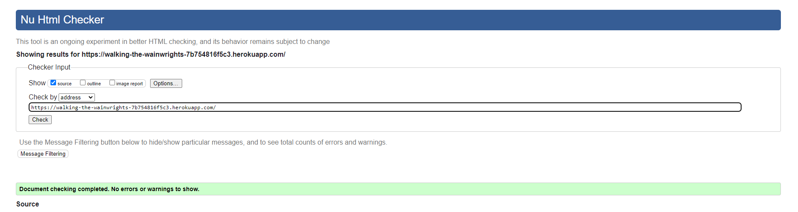
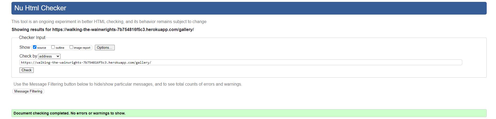
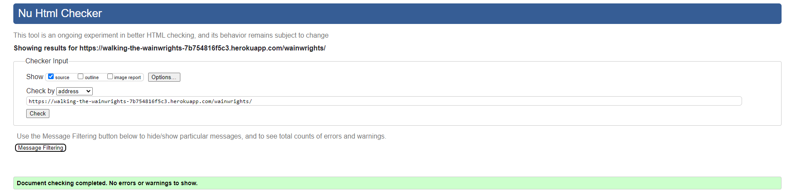
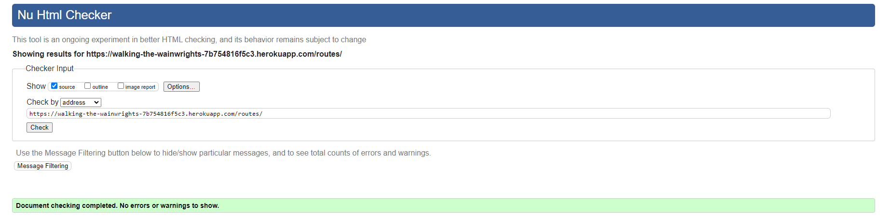
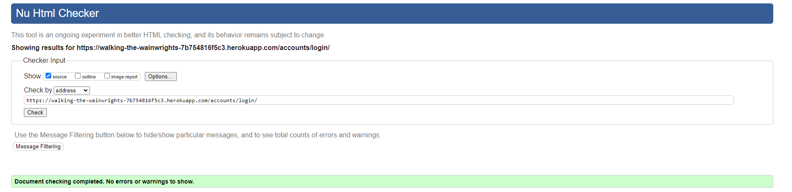
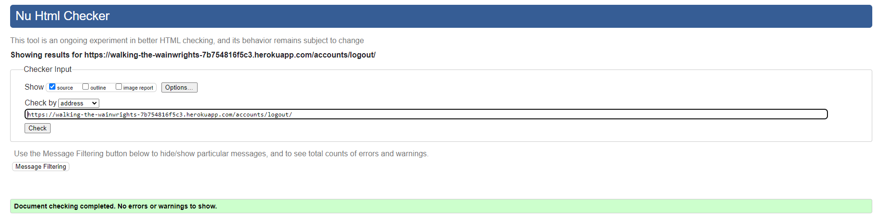
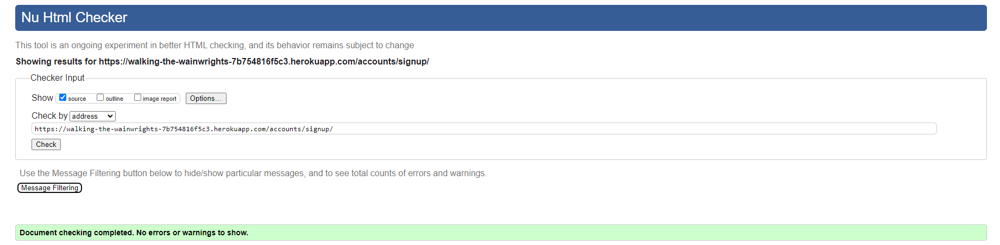

# Walking the Wainwrights

(Developer: Martin Bradbury)

## Live website

Link to live website: [Walking the Wainwrights](https://walking-the-wainwrights-7b754816f5c3.herokuapp.com/)

## Purpose of the project

The purpose of my website is to share my personal journey and experiences of walking all the Wainwrights in the Lake District. It's a digital diary where I document my routes, share images, and narrate my adventures. I aim to inspire and connect with fellow enthusiasts of the Lake District by providing a space for them to engage with my content, learn from my experiences, and perhaps even plan their own routes. Additionally, my website offers a unique opportunity for users to interact with me directly, either through contact forms or by leaving messages on my routes. This interactive feature fosters a sense of community among my visitors, encouraging them to share their own experiences, images, and stories of their walks in the Lake District. By creating a space where users can contribute their own content, my website not only serves as a personal blog but also as a collaborative platform for sharing and discovering the beauty and challenges of the Lake District together.

## Table of contents

## User experience (UX)

### Key project goals

- Sharing Personal Experiences: To share your personal experiences, routes, and images from your walks, aiming to inspire and engage fellow enthusiasts of the Lake District.
- To Build a Community: I want to foster a sense of community among my visitors by allowing them to interact with me directly, either through contact forms or by leaving messages on my routes.
- To Encourage Content Contribution: I'm looking to encourage users to contribute their own experiences, images, and stories of their walks in the Lake District, thereby creating a collaborative platform for sharing and discovering the beauty and challenges of the Lake District together.
- To Provide Educational Value: I plan to provide educational content, such as detailed routes, tips for navigating the Lake District, and insights into the history and significance of the Wainwrights, to enhance the visitor's understanding and appreciation of the area.
- To Promote the Lake District: Ultimately, I want to promote the Lake District as a destination for outdoor enthusiasts, showcasing its natural beauty, challenging walks, and rich history, to encourage more people to visit and explore the area.

### Target Audience

- Outdoor Enthusiasts: Individuals passionate about outdoor activities, particularly hiking and exploring natural landscapes.
- Walking and Hiking Communities: Groups interested in the Lake District and the Wainwrights, looking for inspiration, routes, and stories from fellow enthusiasts.
- Fell Running and Walking Enthusiasts: People who enjoy the challenge of fell running and walking, seeking to connect with others who share their passion for the Lake District.
- Travelers and Adventure Seekers: Individuals looking for unique travel destinations and adventures, interested in the Lake District's natural beauty and the challenge of the Wainwrights.

### User requirements and expectations

- Access to my Detailed Routes, videos and Images: Users expect to find information on my detailed routes taken as I endevour to summit all the Wainwright.
- Interactive Features: Users anticipate interactive features such as a map of my routes, video of each route and images taken along the way. Each Wainwright I have completed is listed with its details, and its rank in terms of height.
- Community Engagement: Users look forward to engaging with the community through features like message boards, and the ability to upload their own images and experiences. This fosters a sense of community and encourages sharing of personal stories and routes.
- Educational Content: Users appreciate educational content that provides insights into the wainwrights I have completed.
- Efficiency and Planning: Users expect resources that help them plan their walks efficiently. They can either download the route I have taken and use for themselves or use it in the planning process for their route. All the routes have been graded with a difficulty form 1-5.

## Epics and User Stories

1.  Epic: User Registration:
    -   User Story 1: As a new user, I want to register on the website so that I can share my experiences and contribute to the community.
    -   User Story 2: As a registered user, I want to be able to upload my images, write about my experiences and like / comment on posts.

2.  Epic: Route Planning and Sharing:
    -   User Story 1: As a user, I want to view detailed interactive maps of the routes the site admin has taken while completing the Wainwrights. Descriptions about the route including difficulty as well as videos to add a more visual representation of the route. I want to be able to download and use the route.
    -   User Story 2: As a user, I want to share my own photos and experiences with the community, so that others can see my journey.

3.  Epic: Community Interaction:
    -   User Story 1: As a user, I want to contact the website owner directly or leave messages on their routes and photos.
    -   User Story 2: As a user, I want to interact with other community members through comments and forums, so that I can share my experiences and learn from others.
    -   User Story 3: As a user, I want to be able to delete my account and all the posts / imgaes I have left on the website. 

4.  Epic: Educational Content and Resources:
    -   User Story 1: As a user, I want to access educational content about the Lake District and the Wainwrights the site owner has completed, so that I can deepen my understanding and appreciation of the area.
    -   User Story 2: As a user, I want to find resources for planning my walks, such as interactive maps of the site owners routes with all relevant information needed about the routes taken so that I can explore the Lake District more efficiently.

5.  Epic: Promotion of the Lake District:
    -   User Story 1: As a user, I want to discover new walks and destinations in the Lake District, so that I can plan my next adventure.
    -   User Story 2: As a user, I want to share my experiences and images of the Lake District with others, so that I can promote the area and inspire more people to visit.

##  As site Admin:

6.  Epic: Database and Admin Setup:
    -   Full backend CRUD on Routes, Images and comments.
    -   Approve posts, images and comments.
    -   Create route posts so users are able to see the routes I have taken.
    -   I can flag potential posts and images that are sensetive.
    -   I can respond to contact requests and mark as read.

7.  Epic: Routes and Images pages:
    -   Read other users comments and view their uploaded photos.
    -   Edit comments I have made, route blogs made and images uploaded.
    -   Delete my route posts, comments and images.

##  Features:

### Nav bar

A fully responsive navigation bar is in has been used. The main focus was on a 'mobile first' design where a clickable burger icon with a drop down menu appears on mobile. There is a burger icon is functional on tablets too upto and not including the ipad pro 12.9. Desktop view the burger menu disappears and the navigation menu appears along the navigation bar. The links in the Navigation element are: 'About' - Which takes you to the homepage, 'Routes' - Navigates to the routes page, 'Gallery' - which navigates to the photo gallery page, 'Logout' - if already logged in, 'Register' - Navigates to signup page and 'Login' - Which enables an existing user to login. The title is also clickable and navigates to the about page. The Nav bar also indicated to the user if they are signed in or not and remain sticky to the top of the window.

#### Desktop Navigation

#### Mobile Navigation

#### Signed in status

### Hero image Carousel

The hero image is a carousel of 3 images the site admin has the opportunity to change at any point in django admin. The carousel can rotates each image on all devices or can be manually invoked by clicking the left or right arrow.

#### Carousel Desktop

#### Carousel Mobile

#### Admin control of carousel images

### About me cards

The mid section of the homepage (about page) comprises of 3 cards with a heading a description. These cards inform the user what they will find in each of these sections and help to draw their attention using imigary of what they are linkely to find in each section. The whole card is clickable and links to the corrospoiding page in the website.

#### About cards Desktop

#### About cards Mobile

### About me content

This section informs the user about my journey and my goals. It sets the tone for what the website is about and what they can expect. This section has a contact me button which links to a contact for page and a return to top of page button to save the user scrolling up.

#### About me desktop

#### About me Mobile

#### Contact me button

#### Return to top button

### Social meadia footer

The footer has links to social media where users are able to interact with me further. All the buttons are clickable and open the social media in a new window or tab.

#### Social media footer desktop

#### Social media footer mobile

### Contact me

This section offers the user the opportunity to send me a message directly. All fields are required for the user to send me a message and the user is informed when the message has been sent successfully with a django message. These features work on all device sizes and are fully responsive. 

#### Contact me desktop

#### Contact me mobile

### Routes page

The routes page is created by the admin and displays the different routes I have completed. Each route is displayed in a clickable card which takes them to the specific page for that route. The route card has a image of the route taken, the heading for the route and a snippet of the description of the route. It also has the date the route was posted and by who. On desktop the route cards are displayed in pairs with a max of 4 cards per page. On mobile devices the route cards will be displayed in a column with a max of 4 per page and the most recent on top. Pagination is used on both mobile and desktop to navigate between pages of the route cards and the most recent route will be displayed first. 

#### Route cards Desktop

#### Route cards Mobile

#### Pagination Desktop

#### Pagination Mobile

### Route detail page

When the user selects a route and clicks on the card they are taken to the routes detail page. This page highlights the route title at the top and below on desktop has a fully interactive os map which has been imported from Outdooractive with the route I have taken. This map can be zoomed and tracked around to the users desire. On mobile and overlaying the map on desktop there is a brief summary of the route statistics on the map with a button offering the user to learn more. (Not there is an interactive map on mobile when the user clicks the learn more).

#### Interactive map

#### Interactive map zoomed

Once clicked a pop up will appear with all the details and statistics of the hike. It will give the user a larger interactive map, a 3D generated video of the route taken and statitics. It will also give the user the opportunity to download the GPX, KML, FIT file of my route so they are able to navigate from it from any navigation device they may have. This pop up can be exited by clicking the cross on the top right corner. 

#### Learn more page

#### deeper statistics

#### Download navigation files

#### Close popup

#### Difficulty rating

Back on the route detail page there is a difficulty rating where fontawesome icons have been used and a score is given for the difficulty. 

#### Like button and counter

There is a like button and like counter. The like button can only be interacted with if the user is logged in. 

#### Hike desctiption
There is a description of my experiences on this particular hike. 

#### 3D Hike Video

There is an embeded youtive video of a 3D representation of my hike. 

#### Comment form

There is a comment form where the user is able to leave a message about this particular route. The user must be logged in to comment. 

When commented the user will recieve a message saying their comment is waiting approval and they will see a faded message. They are able to edit this message and / or delete the message. When the select edit the origional message will appear in the body and the button will change to update. Django messages will inform the user when these tasks have been completed successfully. 

#### Message counter and Approved messages

There is a message counter that shows how many messages there are on this route of which have been approved. Approved messages appear in black text and detail the author and time posted. 

### Gallery

The gallery section displays images uploaded by the site admin or the users. The images appear in cards with a priview of the image at the top of the card and the heading and comment below it. The cards also display when the image was posted and by who. The image cards are clickable to reveal more detail. On desktop the cards are displayed in pairs with a maximum of 4 per page. On mobile the images are displaye in a column with a max of 4 per page. The page has pagination to navigate between the gallery pages. 

#### Image cards Desktop

#### Image cards Mobile

#### Pagination

#### Gallery image detail

On clicking on the image card the user will be taken to the specific picture page. On desktop the image will be larger and in more detail. Just like on the route page, logged in users will be able to like the image, see the like counter and also comment on the image. On mobile devices the user will be able to like and comment on the image but it will not display larger due to screen size. 

#### Larger Image

#### Like button

#### Comment Section

#### Upload a photo

On the gallery page logged in users are able to upload photos. The upload photo uses a javascript widget from cloudinary which presents users with many ways to upload the photo. The widget also takes care of image formatting but only allows users to upload photos less than 10mb. The users have to then give the photo a title and brief description which will be displayed on the gallery card and detail. These are required fields. Once submitted the users are presented with a message informing them they the image has been submitted and waiting approval. 

#### Upload image form

#### Upload image widge
Desktop:

Mobile:

#### Image uploading

#### Image input fields

#### Image message success

### Wainwrights

The wainwrights page is a simple page that just details all the Wainwrights I have completed. It comprises of cards 4 per row on desktop and stacked vertically on mobile. Each card has the image of the Wainright and a description of the Wainright with its height. The card also indentifies if I have completed this Wainwright or not. These cards are not clickable. 

#### Wainwrights Desktop

#### Wainwrights Mobile

### Login, Logout, Register

The user login, logout and register page and styled for the purpose of the website but have all the same functionalite that Django Auth brings. Users are required to create an accout with a password that meets the minimim requirements. All fileds need to be completed with the exception of the email field. The Logout form logs the user out of that session. The login for asks for the users username and password. After successfully logging in, logging out or registering the users are take to the about page.

#### Login Desktop

#### Login Mobile

#### Logout Desktop

#### Logout Mobile

#### Register desktop

#### Register mobile

### Admin Control

The Django Admin control enables the admin to approve images, and comments as well as ccreating routes and updating the carousel images on the about page easily. Filter methods have been added to easily see posts and actions have been added to enable to admin to approve or delete multiple posts quickly and easily. 

#### Admin Control

#### Admin filters

#### Admin actions

##  Future Features:

1.  Enable users to post their own routes that people can comment on.
2.  Allow users to reply to specific comments in the comments section rather than them just appearing in a list.
3.  Utalise the flagged function I put into the database so if the user deletes their account, all posts are deleted that are flgged for sensitive information but any other comments remain but only the username is removed. This will enable consistency when following convocations. 
4.  All the wainwrights will be detailed in the wainwrights section with a key at the top of the page to go directly to the wainwright. 
5.  The wainwright cards are clickable to reveal more information, map grid ref and interactive map.

##  Design:

The design of the website was simple contrast of a dark black background and lighter white text. This enabled the cards to stand out. 

### White Text: rgba(255, 255, 255, 0.692);

### Black: Black

### Hover: rgba(255, 255, 255, 0.2);

### Card Background colour: rgba(255, 255, 255, 0.879);

##  Wireframes:

The overall structure of the website was kept from initial inception of wireframes to the result of the website on submission for assessment. Slight alterations were made to the layout of the about page and wainwrights page. These alterations were made to improve the feel of the website and UX. All initial wireframes can be seen below and were created using Adobe Xd. 

### About page

#### Desktop

#### Mobile

### Gallery page

#### Desktop

#### Mobile

### Routes page

#### Desktop

#### Mobile

### Routes detail

#### Desktop

#### Mobile

### Gallery Detail

#### Desktop

#### Mobile

##  Database Schema:

Here you can find my initial ERD (Entity Relationship Diagram). This got modified significantly as my project developed and I realised I had the opportunity to develop more features and fields to my databases.

##  Technology Used:
### Languages and framework:

- [HTML5](https://developer.mozilla.org/en-US/docs/Learn/HTML "link to html mozilla documentation")
  was used to create content and structure
- [CSS](https://developer.mozilla.org/en-US/docs/Learn/CSS "link to css mozilla documentation")
  was used to add custom styles
- [JavaScript](https://developer.mozilla.org/en-US/docs/Web/javascript "link to javascript mozilla documentation") was used to dynamically reset the comment form if the reset button was clicked and to show a modal when the edit comment button was clicked
- [Django](https://www.djangoproject.com/ "link to django docs homepage") was the python framework used to develop the site

### Database:

- [PostgreSQL from ElephantSQL](https://www.elephantsql.com/ "link to elephantSQL") was used as the PostgreSQL database for this project.

### Technologies and tools:

- [GitPod Code](https://www.gitpod.io/ "link to Gitpod webpage") was used as the ide for this whole project.
- [Cloudinary](https://cloudinary.com/ "link to cloudinary homepage") was used to host images.
- [GitHub](https://github.com/ "link to github webpage") was used to store the code files, README files and assets
- [Git](https://git-scm.com/ "link to official git website") was used as a version control software to commit and push the code to the GitHub repository
- [Heroku](https://id.heroku.com/login "link to Heroku login") was used to deploy the project
- [lucidcharts](https://www.lucidchart.com/pages/ "Link to lucidcharts") was used to make a diagram of the database schema and entity relationship diagrams.
- [Prettier](https://prettier.io/ "link to official prettier website") was used as the default formatter in Gitpod IDE, for html and css files.
- [Bootstrap](https://getbootstrap.com/ "link to official bootstrap website") was used to quickly layout, position and size critical website features
- [Adobe Xd](https://www.adobe.com/home/ "link to official Adobe website") was used in early planning to map out wireframes
- [Google Fonts](https://fonts.google.com/ "link to official google fonts website") was used to import fonts
- [Font Awesome](https://fontawesome.com/ "link to official font awesome website") was used for all icons
- [Google Chrome Developer Tools](https://developer.chrome.com/docs/devtools/overview/ "Link to official chrome developer tools website") was used for lighthouse testing, debugging and consistently checking responsiveness
- [W3C Markup Validator](https://validator.w3.org/ "link to official html validator") was used to validate all live html
- [Jigsaw CSS Validator](https://jigsaw.w3.org/css-validator/ "link to official css validator") was used to validate CSS code
- [JS Hint](https://jshint.com/ "link to official javascript validator") was used to validate JavaScript code
- [Code Institute Python Linter](https://pep8ci.herokuapp.com/ "link to official python validator") was used to validate all python code
- [Django Summernote](https://pypi.org/project/django-summernote/ "link to official summernote website") was used. This is a rich text editor plugin for Django
- [Django Crispy Forms](https://pypi.org/project/django-crispy-forms/ "link to official crispy forms website") were used throughout the project to quickly create forms

## Testing:

### HTML Validation

All HTML pages were tested with the [W3C HTML Validator](https://validator.w3.org/).

#### HTML Result

| page                   | validator                                                                                                                                | result |
| ---------------------- | ---------------------------------------------------------------------------------------------------------------------------------------  | ------ |
| about                  |  

About Page

                                                | PASS   |
| gallery                |  

Gallery Page

                                            | PASS   |
| wainwright             |  

Wainwright Page

                                     | PASS   |
| Routes                 |  

Routes

                                                   | PASS   |
| Gallery Detail         |  

Gallery Detail

                                   | PASS   |
| Route Details          |  

Register

                                         | PASS   |
| sign in page           |  

Sign In

                                                   | PASS   |
| logout page            |  

Sign Out

                                                 | PASS   |
| sign up page           |  

Register

                                                 | PASS   |

### CSS Validation

Custom CSS was put through the [W3C CSS Validator](https://jigsaw.w3.org/css-validator/).

#### CSS Result

Pass

### JS Validation

JavaScript code in the comment.js and image.js file was put through the [JSHint Validator](https://jshint.com/).

#### JS Result

The js code for both files passed.

#### Comment.js

#### Images.js

### Python Validation

All python code was put through the [CI Python Linter](https://pep8ci.herokuapp.com/).

#### Python Result

| File            | Validator                                                                                                                | Result |
| --------------- | ------------------------------------------------------------------------------------------------------------------------ | ------ |
| About admin     |  

About Models

            | PASS   |
| About apps      |  

About Views

              | PASS   |
| About model     |  

About Forms

             | PASS   |
| About urls      |  

About urls

               | PASS   |
| About views     |  

About Admin

             | PASS   |
| Contact admin   |  

Blog Models

           | PASS   |
| Contact forms   |  

Blog Views

            | PASS   |
| Contact models  |  

Blog Forms

           | PASS   |
| Contact URLs    |  

Blog urls

              | PASS   |
| Contact Views   |  

Blog Admin

            | PASS   |
| Gallery admin   |  

Makeover Models

       | PASS   |
| Gallery Apps    |  

Makeover Views

         | PASS   |
| Gallery Model   |  

Makeover Forms

       | PASS   |
| Gallery Urls    |  

Makeover urls

          | PASS   |
| Gallery Forms   |  

Makeover Admin

        | PASS   |
| Gallery View    |  

Settings

               | PASS   |
| Routes admin    |  

Makeover Models

        | PASS   |
| Routes Apps     |  

Makeover Views

          | PASS   |
| Routes Model    |  

Makeover Forms

        | PASS   |
| Routes Urls     |  

Makeover urls

           | PASS   |
| Routes Forms    |  

Makeover Admin

         | PASS   |
| Routes View     |  

Settings

               | PASS   |
| Settings        |  

Settings

                   | PASS   |

### User Testing:

### bugs

##  Deployment:

##  Credits
### Code
### Images

## Acknowledgements